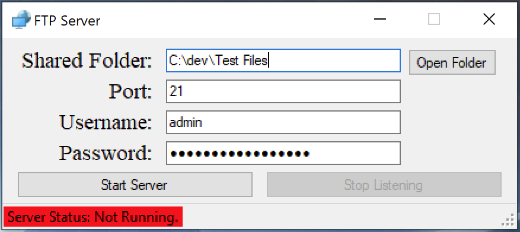
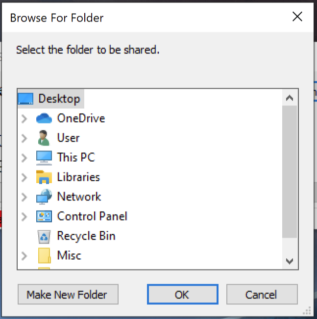
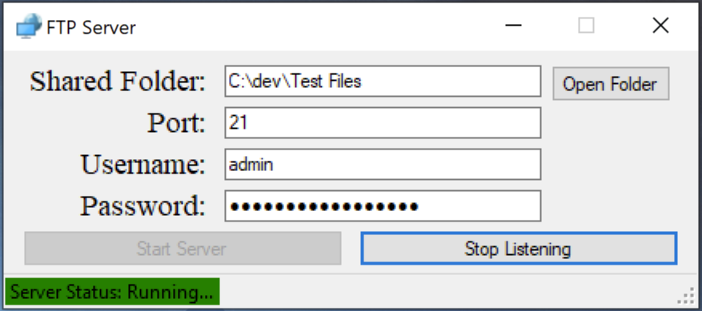

# C# FTP Server

This is the server part of a simple C# based FTP Server/Client project. This server supports a range of FTP commands for normal usage and uses a username/password for authentication when connecting. The connection for the server is not encrypted. 

[C# FTP Client](https://github.com/DAVRUS06/C-Sharp-FTP-Client) is the client side of this project. 

# Supported FTP Commands

The commands implemented are:

* STOR - Upload file
* LIST - List directory
* TYPE - Type of data being transfered
  * Supports
    * ASCII
    * Image/Binary
* PORT - Port server will listen on
* PASV - Passive Connection
* USER - Username
* PASS - Password
* RETR - Download file
* CWD - Change working directory
* PWD - Print working directory
* QUIT - Quit
* MKD - Make new directory
* RMD - Remove a directory
* CDUP - Go to parent directory
* RNFR - Rename from
* RNTO - Rename to
* DELE - Delete file

All other commands not implemented will receive a "502 command not implemented response" 

# Using the Server

The server is simple and easy to use. Upon opening the window in figure 1 will appear.

##### Figure 1: Server Window

As can be seen in figure 1 there is a option for selecting the path to be shared by the server. The port # for listening for connection can be changed and the username/password combo should be typed in. Port defaults to FTP default which is port 21 and username/password default to admin. Clicking the open folder button will show another window allowing the user to select a folder as shown below in figure 2.

##### Figure 2: Select shared folder

Once the folder is selected the port can be changed to whatever number is needed and the username/password should be changed from their defaults. Then clicking the "Start Server" button will start the server and the status at the bottom will change as seen below in figure 3.

##### Figure 3: Server Running

Clicking the "Stop Listening" button stop the server from listening to new connection and will stop the server from listening to any new clients. The server will also stop serving any current clients until the start server button is pressed again. 